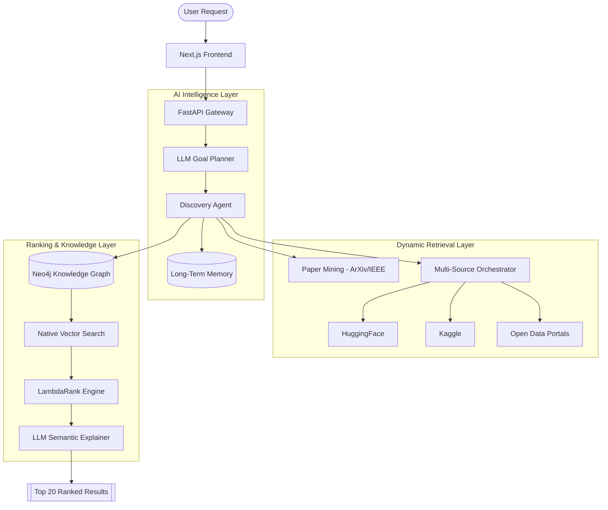

# Ranqora: Dataset Intelligence Infrastructure
## AI-Powered Autonomous Dataset Discovery & Adaptive Ranking Platform

---

# 1. Vision & Mission

Ranqora is a multi-agent AI infrastructure designed to eliminate discovery friction for research and development datasets. Unlike traditional search engines, Ranqora **perceives, plans, and pursues** dataset discovery using an autonomous exploration loop.

**The Vision:** To build the world's most intelligent dataset knowledge graph that automatically evaluates, ranks, and compares datasets based on the subtle nuances of project context.

---

# 2. Core Objectives

1.  **Autonomous Exploration**: Move beyond keyword matching to intelligent, iterative discovery.
2.  **Academic-Practical Hybrid**: Seamlessly bridge the gap between academic benchmarks (ArXiv/IEEE) and practical implementation platforms (HF/Kaggle).
3.  **Explainable Intelligence**: Provide deep, semantic reasoning for every recommendation.
4.  **Adaptive Ranking**: Utilize user feedback and community signals to evolve the ranking model (LightGBM LambdaRank).
5.  **Graph-Driven Credibility**: Establish dataset authority through citation networks and structural knowledge edges (Neo4j).

---

# 3. System Evolution

### MVP Stage (Semantic Retrieval)
- Initial iteration: Simple cosine similarity over HuggingFace metadata.

### Multi-Source Stage (Tool Orchestration)
- Introduction of the `RetrievalOrchestrator` and `ToolRegistry`.
- Support for Kaggle, ArXiv, and Open Data portals.

### Agentic Stage (The Current State)
- **DiscoveryAgent**: An autonomous agent that runs an iterative loop (Perceive -> Plan -> Explore -> Evaluate).
- **Paper Mining**: Proactive extraction of dataset names from research papers via ArXiv and IEEE APIs.
- **Graph Ingestion**: Automated mapping of discovered datasets into a Neo4j Knowledge Graph.

---

# 4. High-Level Architecture

---

# 5. Core Intelligence Modules

### 🧠 Discovery Agent (`discovery_agent.py`)
The heart of Ranqora. It operates on an iterative autonomous loop:
- **Perceive**: Parses query intent, modality, and domain constraints.
- **Plan**: Strategically selects search queries and tool priorities.
- **Explore**: Parallel execution across platforms with early-stopping logic.
- **Evaluate**: Real-time confidence scoring and expansion suggestion.

### 📄 Paper Discovery (`paper_discovery_service.py`)
Unique "Academic-First" approach:
- Scans ArXiv and IEEE Xplore for recent research papers related to the query.
- Extracts "Seed Datasets" mentioned in abstracts.
- Injects these high-value benchmarks into the retrieval pool.

### 🕸️ Graph Service (`graph_service.py`)
Structural intelligence via Neo4j:
- **Native Vector Search**: High-performance retrieval using `db.index.vector.queryNodes`.
- **Similarity Edges**: Dynamically links datasets based on embedding distance.
- **Title Indexing**: Specialized index for higher quality query expansion.

### 📊 Ranking Engine (`ranking_service.py`)
A multi-factor hybrid system:
- **LambdaRank**: A LightGBM Learning-to-Rank model that adapts based on user clicks/downloads.
- **Semantic Alignment**: Split-field embedding matching (Title/Desc/Tags).
- **Signal Weighting**: Combines quality, license, freshness, and graph centrality.
- **Decoupled Explanation**: LLM no longer performs mandatory ranking; it provides deep semantic "Why relevant" logic for the top results.

---

# 6. Premium Frontend Layer

### Real-Time Interaction
- **Agent Reasoning Trace**: Users can watch the agent's internal thought process and strategy in real-time.
- **Multi-Stage Progress**: Granular SSE updates for Perception, Discovery, Ingestion, and Ranking.

### Mobile-First Design
- **Responsive Layout**: Edge-to-edge screens with horizontal filter scrolling and optimized card views.
- **Micro-Animations**: Framer Motion powered transitions and interactive hover-tilt effects.
- **Rich Visualization**: Interactive "Agent Memory" popups for deep query context visibility.

---

# 7. Tech Stack

| Layer | Technologies |
| :--- | :--- |
| **Frontend** | Next.js, Tailwind CSS, Framer Motion, Lucide Icons |
| **Backend** | FastAPI, Uvicorn, Pydantic |
| **AI/ML** | Google Gemini (Pro/Flash), LightGBM, BGE Embeddings |
| **Graph DB** | Neo4j (GrapheneDB / Aura) |
| **Search Tools** | Kaggle API, HuggingFace API, IEEE Xplore, ArXiv API |
| **Deployment** | Docker, HuggingFace Spaces, Vercel |

---

# 8. Competitive Advantage

- **Autonomous Agent**: Unlike search bars, Ranqora *explores* the solution space.
- **Academic Mining**: Discovers hidden benchmarks not yet indexed on Kaggle/HF.
- **Graph-First**: Uses structural credibility signals (citations/similarity) for superior ranking.
- **Zero Friction**: Unified authentication and rate-limiting using IP-based Client IDs.

---

# End of Project Context
